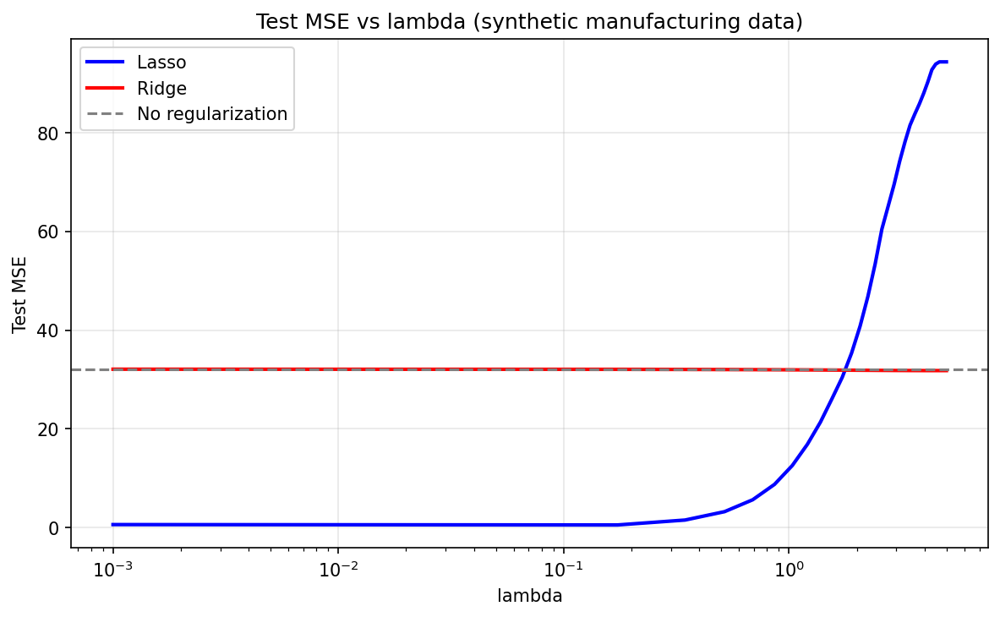
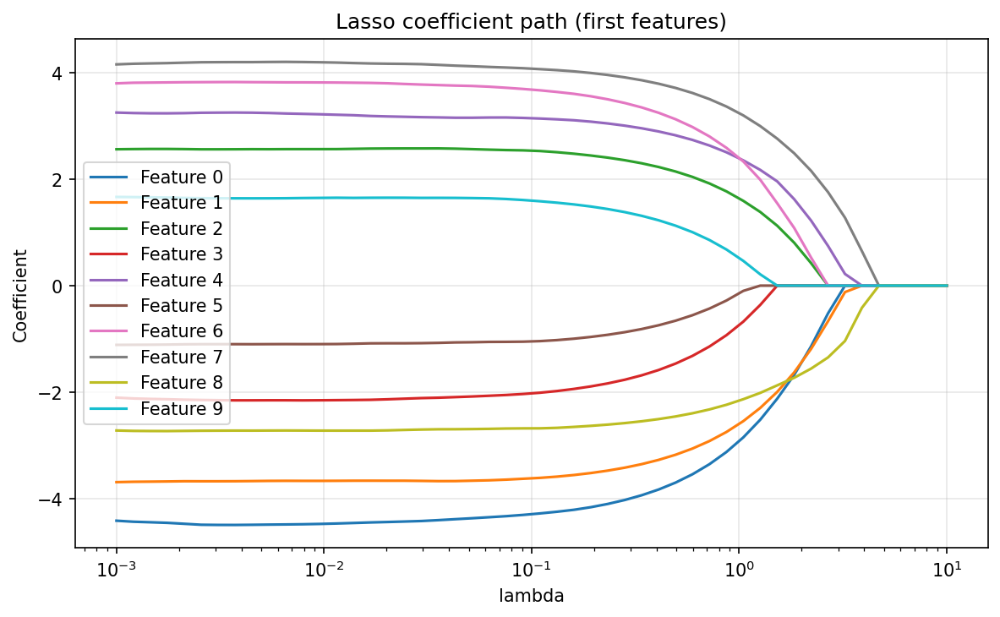
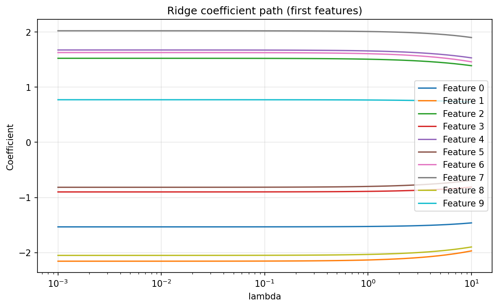
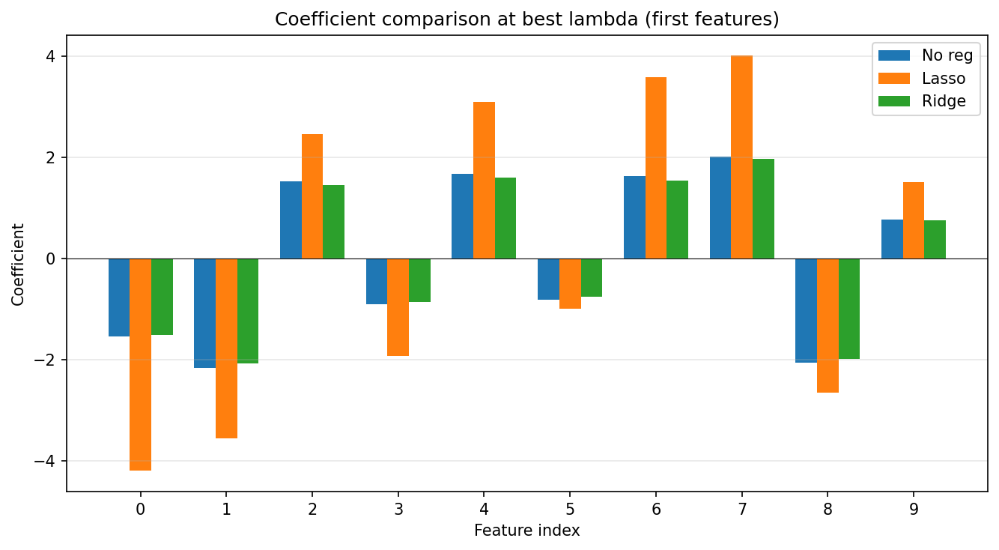
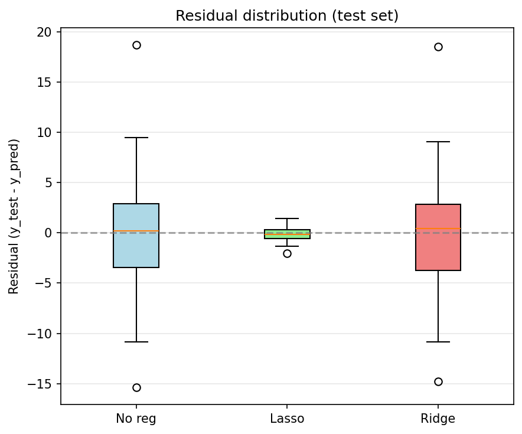
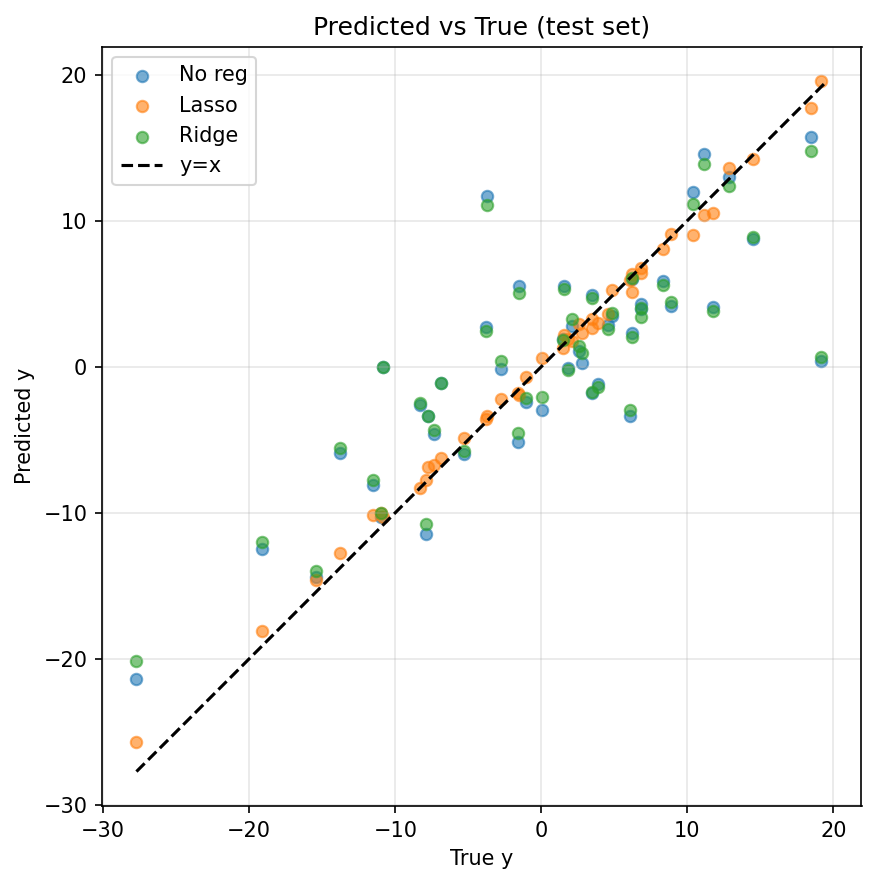
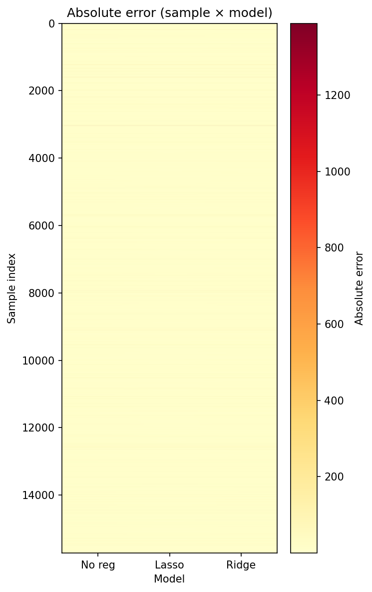
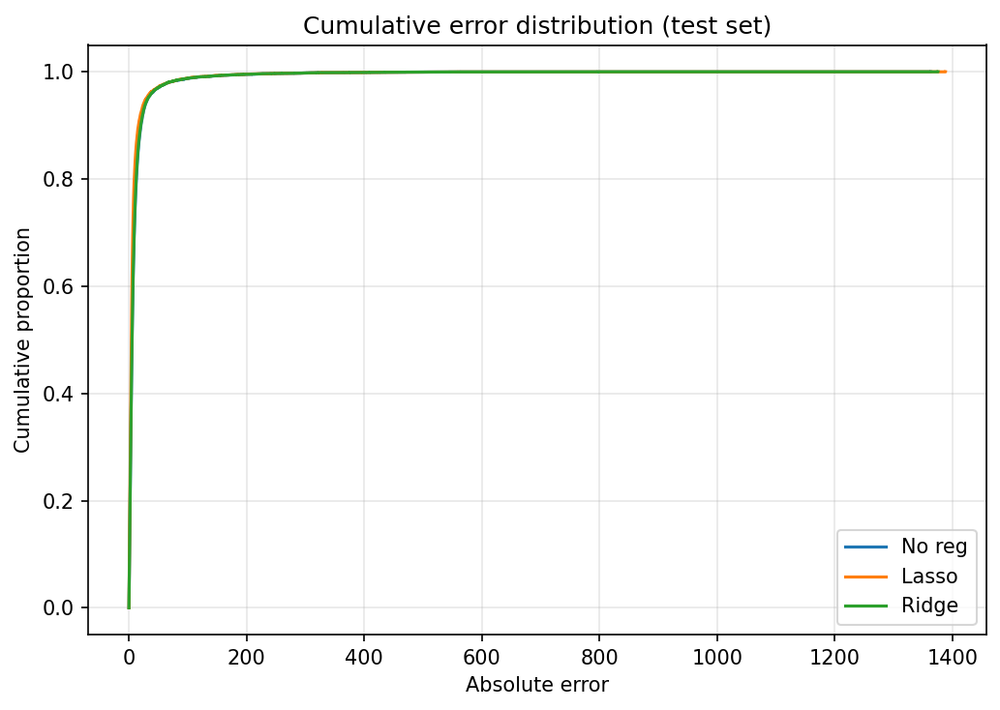

# 题目1：机器学习正则化中的范数应用 —— 实验与汇报说明

本文档对应课程汇报 PPT（`file_3_16/汇报.tex`）的书面整理，并插入 PPT 中使用的实验图片，便于查阅与复现。

---

## 一、汇报结构概览

- **对应知识点**：向量范数、矩阵范数、范数等价性  
- **场景**：线性回归 L1/L2 正则化，特征矩阵 $X \in \mathbb{R}^{m \times n}$，标签 $y$，参数 $\beta$  
- **目标函数**：
  - $J_1(\beta) = \frac{1}{2m} \|X\beta - y\|_2^2 + \lambda \|\beta\|_1$（Lasso）
  - $J_2(\beta) = \frac{1}{2m} \|X\beta - y\|_2^2 + \lambda \|\beta\|_2^2$（Ridge）

**四个解题角度**：  
1. 解释范数意义，说明稀疏性差异  
2. 证明有限维空间范数等价性  
3. 数值实验对比两种正则化  
4. 分析 F 范数的数值稳定性优势  

---

## 二、角度一：范数意义与稀疏性

- 背景：机器学习在“学”什么、过拟合现象、引入正则化后的损失 $J_1$ / $J_2$。  
- 向量 L1/L2 范数定义与 $\lambda$ 的含义；从梯度下降与“弹簧/恒定推力”比喻理解：L2 易把系数压小但不为 0，L1 易把无关系数压成 0（稀疏性）。  
- 几何直观：L1 约束域为菱形、易与等高线交于坐标轴；L2 约束域为圆、多非零。  

（PPT 中本部分无单独结果图，以概念与公式为主。）

---

## 三、角度二：范数等价性证明

- 定义范数等价（$c_1\|x\|_a \le \|x\|_b \le c_2\|x\|_a$），在 $\mathbb{R}^n$ 中证明 $\|x\|_2 \le \|x\|_1 \le \sqrt{n}\|x\|_2$。  
- 与正则化的联系：L1/L2 理论目标一致（约束参数复杂度），稀疏性差异来自约束域几何形状，非范数不等价。  

（本部分为推导与表格，无实验图。）

---

## 四、角度三：数值实验对比（PPT 中使用的图）

汇报以 **实验3（高维稀疏合成数据）** 为主，并简要展示 **实验2 的两张“丑图”** 说明真实数据与预处理的重要性。

### 4.1 实验3：高维稀疏合成数据（主结果）

- **设定**：150 样本、200 特征，其中仅 10 个特征非零系数；7:3 划分、标准化，按测试集 MSE 选最佳 $\lambda$。  
- **结论**：Lasso 在测试集上误差更低、系数稀疏（约 10 个非零）；Ridge 系数全非零、仅缩小，与角度一理论一致。

**以下为 PPT 中使用的 6 张图（来自 `file_3_16/figs/`，与 `exp3_manufact_data/` 一致）：**

- **测试 MSE 随 $\lambda$ 变化**  
  

- **Lasso 系数路径**（随 $\lambda$ 增大，部分系数被压成 0）  
  

- **Ridge 系数路径**（系数整体变小但不为 0）  
  

- **最佳 $\lambda$ 下三种方法系数对比**  
  

- **残差分布箱线图**  
  

- **预测值 vs 真实值**  
  

### 4.2 实验2：“丑图”与教训（2 张示例）

- **背景**：BlogFeedback 真实数据（280 维，目标=未来 24 小时评论数），分布极偏；`no_Log` 版本直接拟合原始 $y$，损失被少数超大样本主导，可视化效果差。  
- **教训**：真实场景下数据预处理（如对 $y$ 做 $\log(1+y)$）与指标选择很关键；汇报以实验3 为主更清晰。

**PPT 中用于说明“失误”的两张图：**

- **误差热力图**（样本×模型，颜色=绝对误差；易被极端样本拉爆）  
  

- **累积误差分布**（曲线形态“丑”，误差分布很不均衡）  
  

---

## 五、角度四：F 范数的数值稳定性优势

- 矩阵推广与 F 范数定义：$\|W\|_F = \sqrt{\sum_{i,j} |w_{ij}|^2}$。  
- 三点优势：抗噪（酉不变性）、平滑性（处处可微、梯度简单）、条件数改善（$(X^TX+\lambda I)^{-1}$ 降低病态）。  
- L1 / L2 / F 范数适用场景对比表与综合总结（见 PPT）。  

（本部分无单独实验图。）

---

## 六、实验脚本与资源位置

| 内容 | 路径 |
|------|------|
| 汇报 LaTeX 源文件 | `file_3_16/汇报.tex` |
| PPT 用图（含 exp3 六张 + exp2 两张丑图） | `file_3_16/figs/` |
| 实验3 脚本与说明 | `exp3_manufact_data/test3.py`，`exp3_manufact_data/README_exp3_regularization.md` |
| 实验2（BlogFeedback）no_Log / log 版本 | `exp2_real_data/test1_no_Log/`，`exp2_real_data/test2_log/` |
| 实验1（低维合成） | `exp1_manufact_data/regularization_compare.py` |

编译汇报 PDF 建议在 `file_3_16` 目录下执行：  
`xelatex -output-directory=out 汇报.tex`（运行两次以生成完整目录）。
